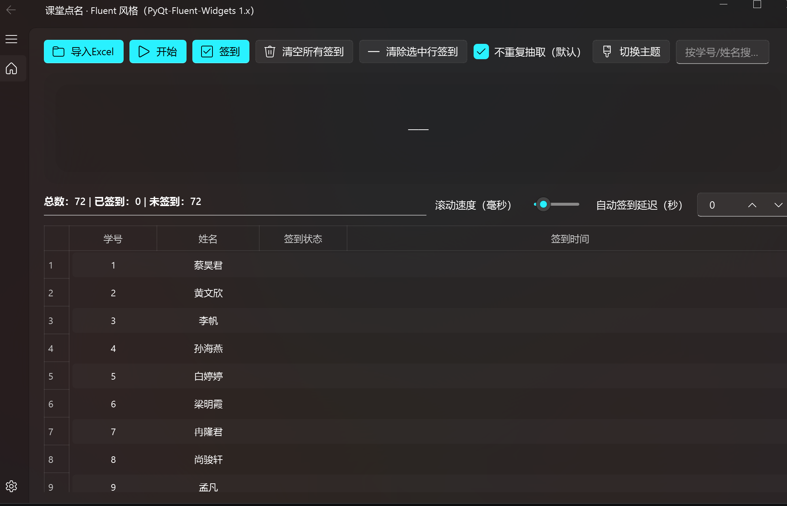

课堂点名 · Fluent 风格（PyQt-Fluent-Widgets 1.x)

- 文件打包：
- pip install -U pyinstaller
- pyinstaller --noconfirm --onefile --windowed --name 点名系统 --icon=app.ico --collect-all qfluentwidgets --hidden-import openpyxl name_picker.py

